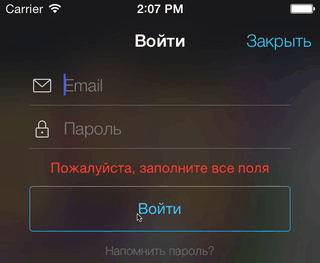

AFViewShaker
=======

## About
AFViewShaker is simple as a brick utility for UIView shake animation.



## Using
##### Create shaker for one view
```objective-c
AFViewShaker * viewShaker = [[AFViewShaker alloc] initWithView:self.formView];
```

##### Create shaker for multiple views
```objective-c
NSArray * allFields = @[self.emailField, self.passwordField];
AFViewShaker * viewShaker = [[AFViewShaker alloc] initWithViewsArray:allFields];
```

##### Shake with default parameters
```objective-c
[self.viewShaker shake];
```

##### Shake with additional parameters
```objective-c
[self.viewShaker shakeWithDuration:0.6 completion:^{
    NSLog(@"Hello World!");
}];
```
