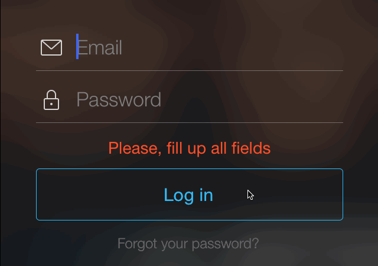

AFViewShaker
=======
[](http://cocoapods.org)
[](https://github.com/Carthage/Carthage)
[]()

## About
AFViewShaker is simple as a brick utility for UIView shake animation.



## Using
##### Create shaker for one view
```objective-c
AFViewShaker * viewShaker = [[AFViewShaker alloc] initWithView:self.formView];
```

##### Create shaker for multiple views
```objective-c
NSArray * allFields = @[self.emailField, self.passwordField];
AFViewShaker * viewShaker = [[AFViewShaker alloc] initWithViewsArray:allFields];
```

##### Shake with default parameters
```objective-c
[self.viewShaker shake];
```

##### Shake with additional parameters
```objective-c
[self.viewShaker shakeWithDuration:0.6 completion:^{
    NSLog(@"Hello World!");
}];
```

## Installation

### Using CocoaPods
Add the following to your `Podfile` and run `$ pod install`
```ruby
pod "AFViewShaker", "~> 0.0.4"
```

### Using Carthage
Add the following to your `Cartfile` and run `$ carthage update`
```ruby
github "ArtFeel/AFViewShaker", ~> 0.0.4
```

## For Xamarin users
If you are using [Xamarin.iOS](https://xamarin.com), check out [this](https://github.com/robert-waggott/Xamarin.ViewShaker) port by [Robert Waggott](https://github.com/robert-waggott).
